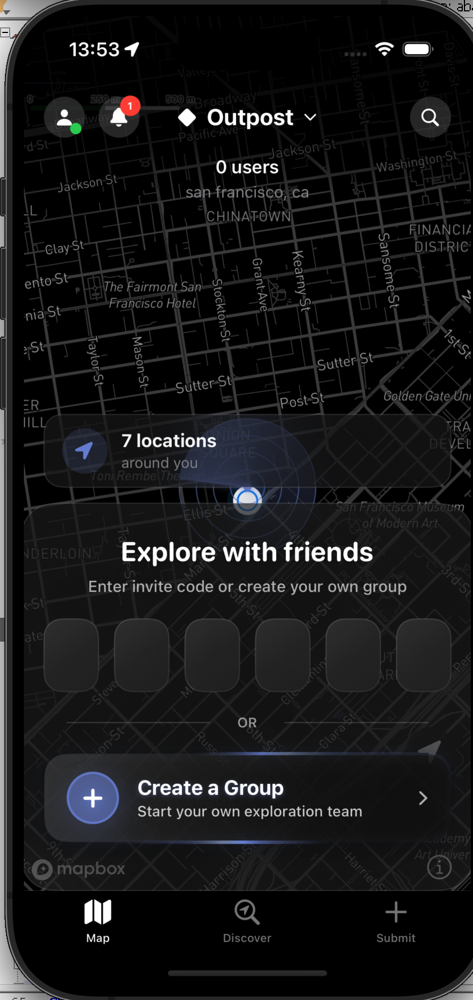
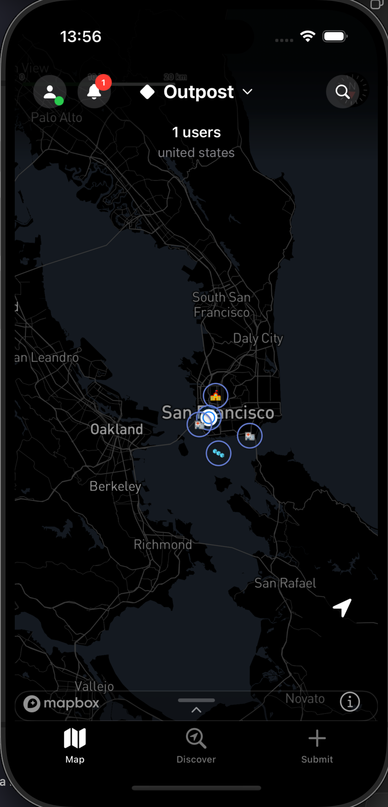
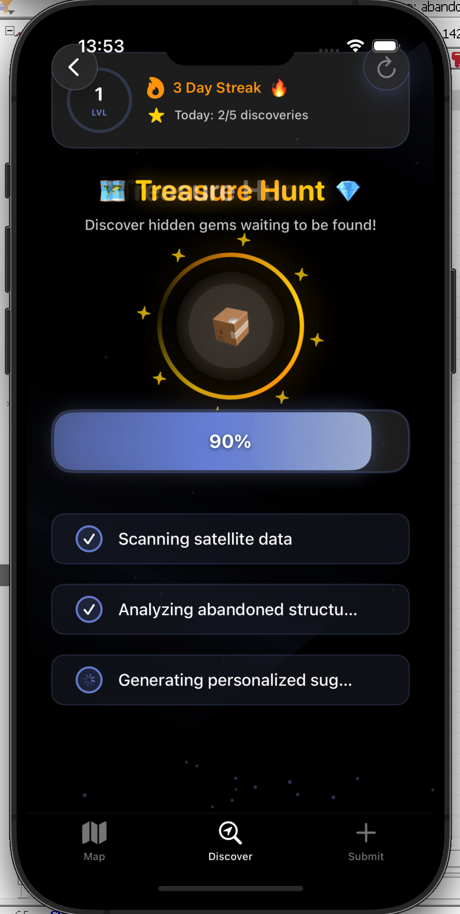
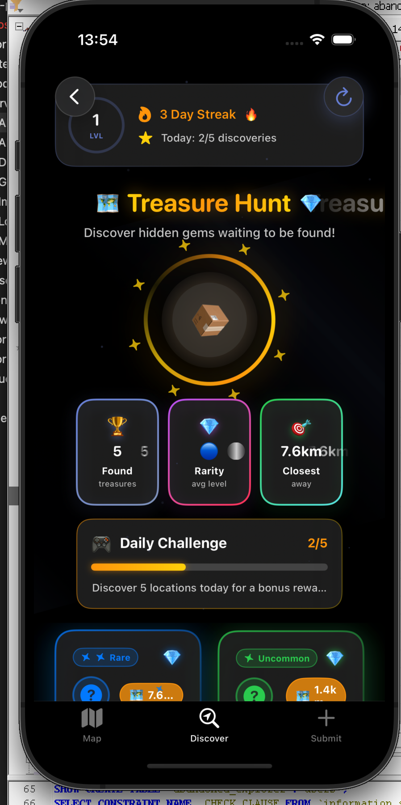
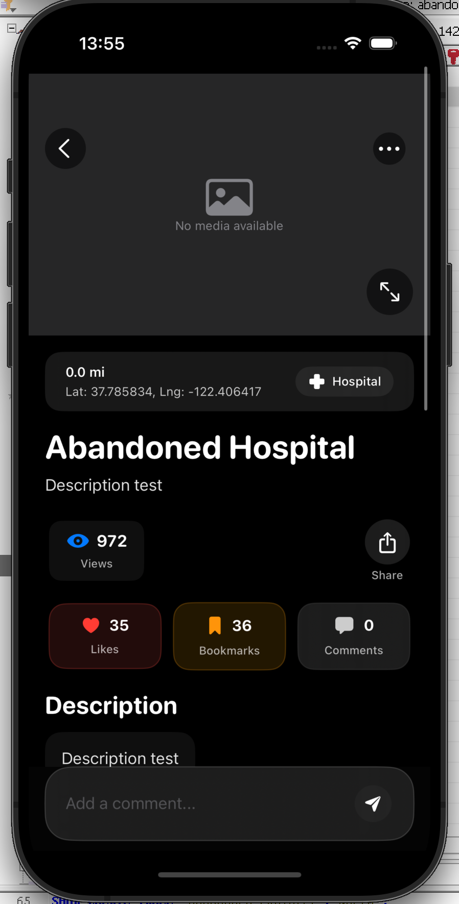
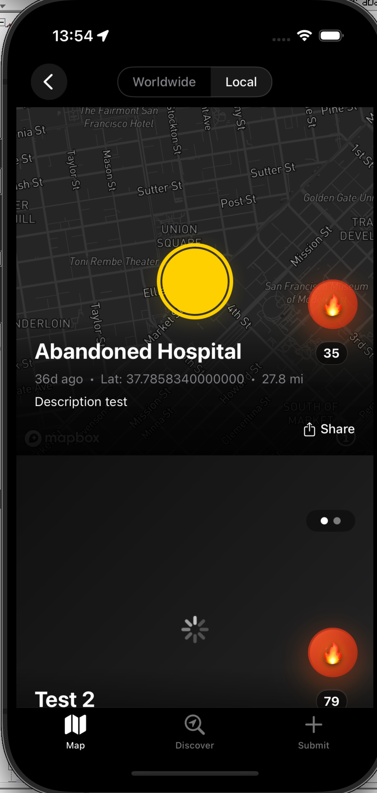
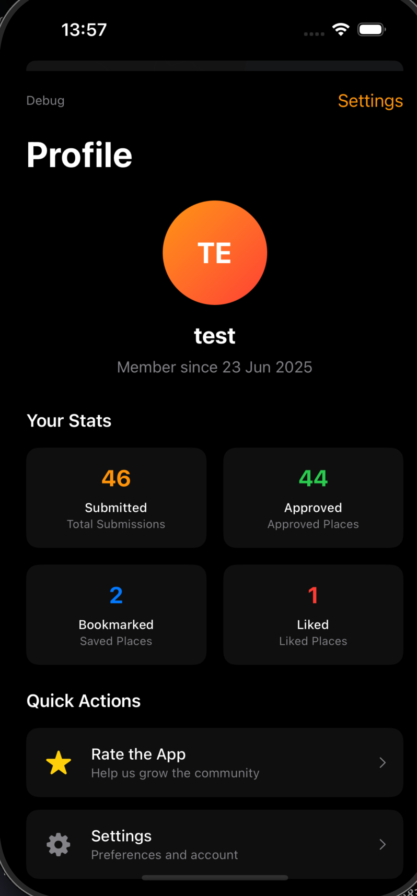
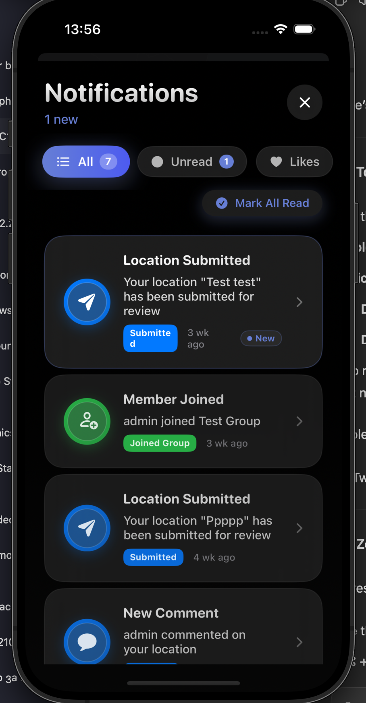
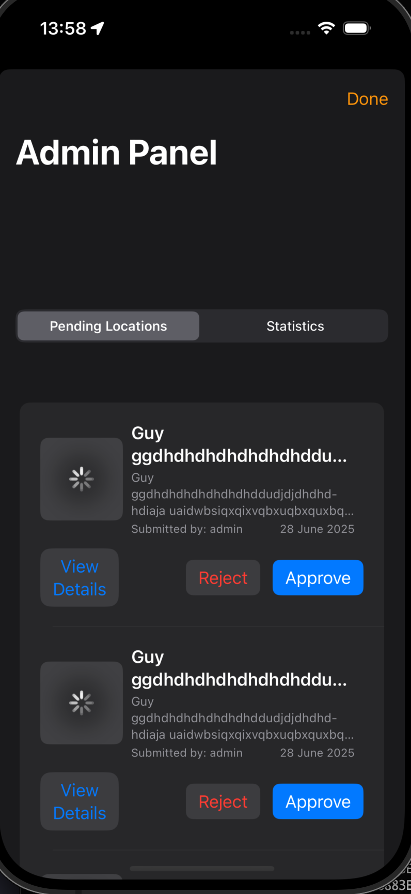

# Abandoned Explorer

> **A comprehensive iOS app and API platform for discovering, documenting, and exploring abandoned locations across the United States. Abandoned Explorer is the ultimate urban exploration companion that combines a vast database of over 3,000 verified abandoned locations with social features, location discovery tools, and community-driven content. Whether you're a seasoned urban explorer or curious about forgotten places in your area, this app provides everything you need to safely discover, document, and share your exploration experiences with fellow adventurers.**

[](https://developer.apple.com/ios/)
[](https://developer.apple.com/xcode/swiftui/)
[](https://nodejs.org/)
[](https://www.mysql.com/)
[](LICENSE.md)

## App Screenshots

<div align="center">

<table>
<tr>
<td align="center"><br><b>Main Screen</b><br><em>Interactive map with location clustering</em></td>
<td align="center"><br><b>Map Overview</b><br><em>Zoomed out view with location clusters</em></td>
<td align="center"><br><b>Discover</b><br><em>Location discovery and exploration</em></td>
</tr>
<tr>
<td align="center"><br><b>Discover View</b><br><em>Detailed location information</em></td>
<td align="center"><br><b>Location Detail</b><br><em>Full location information and media</em></td>
<td align="center"><br><b>Feed View</b><br><em>Community posts and discoveries</em></td>
</tr>
<tr>
<td align="center"><br><b>Profile</b><br><em>User profile and statistics</em></td>
<td align="center"><br><b>Notifications</b><br><em>Real-time activity updates</em></td>
<td align="center"><br><b>Admin Panel</b><br><em>Content moderation tools</em></td>
</tr>
</table>

</div>

## Features

### **iOS App (SwiftUI)**
- **Interactive Map** - Mapbox-powered map with efficient clustering for thousands of locations
- **Groups System** - Create, join, and manage exploration groups with friends for collaborative adventures
- **Local Location Discovery** - Generate new abandoned locations in your area using AI-powered suggestions
- **Community Posting** - Share and post about newly discovered locations to make them public on the map
- **Media Upload** - Submit locations with high-quality photos and videos
- **Real-time Notifications** - Get notified about group activities, location approvals, and friend discoveries
- **User Profiles** - Track submissions, bookmarks, exploration statistics, and friend connections
- **Modern UI** - Beautiful animations, dark theme, and responsive design optimized for exploration
- **Regional Discovery** - Location-based grouping and exploration with detailed area insights
- **Admin Panel** - Built-in moderation tools for administrators and community management

### **Backend API (Node.js/Express)**
- **JWT Authentication** - Secure user authentication and authorization system
- **Location Management** - CRUD operations with spatial indexing and nearby search capabilities
- **Groups API** - Complete group management with roles, permissions, and real-time chat functionality
- **Location Generation** - AI-powered system for suggesting new abandoned locations in user's area
- **Media Upload** - Image and video upload with automatic thumbnail generation and optimization
- **Notification System** - Real-time notifications for all user activities and group interactions
- **Admin Tools** - Location approval workflow, user management, and content moderation
- **Analytics** - User activity tracking, exploration statistics, and engagement metrics
- **API Documentation** - Comprehensive Swagger/OpenAPI documentation for all endpoints

### **Database (MySQL)**
- **Pre-loaded Content** - Over 3,000 verified abandoned locations across the United States included in the SQL file
- **Spatial Indexing** - Optimized for fast location queries and proximity searches within specified radius
- **Groups Schema** - Complete group management with roles, bans, message history, and friend connections
- **Notifications** - Comprehensive notification system with read status and activity tracking
- **Analytics Tables** - User activity, location statistics, exploration metrics, and community engagement
- **Security** - Proper foreign key relationships and data integrity constraints for safe data management
- **Performance** - Optimized indexes for queries handling millions of records and concurrent users

## Architecture

```
┌─────────────────┐    ┌──────────────────┐    ┌─────────────────┐
│  iOS App        │    │  Node.js API     │    │  MySQL Database │
│  (SwiftUI)      │◄──►│  (Express)       │◄──►│  (Spatial Index)│
└─────────────────┘    └──────────────────┘    └─────────────────┘
       ▲                         ▲                       ▲
       │                         │                       │
   ┌───▼───┐                ┌────▼────┐             ┌────▼────┐
   │MapBox │                │ Swagger │             │ Indexes │
   │  Maps │                │   Docs  │             │& Views  │
   └───────┘                └─────────┘             └─────────┘
```

## Quick Start

### Prerequisites

- **Node.js** 18+ and npm
- **MySQL** 8.0+
- **Xcode** 15+ (for iOS development)
- **iOS** 17.0+ (deployment target)

### 1. Clone the Repository

```bash
git clone https://github.com/BRMilev22/abandoned-explorer.git
cd abandoned-explorer
```

### 2. Database Setup

```bash
# Connect to MySQL
mysql -u root -p

# Create database
CREATE DATABASE abandoned_explorer CHARACTER SET utf8mb4 COLLATE utf8mb4_unicode_ci;

# Import schema (choose one)
mysql -u root -p abandoned_explorer < database/abandoned-explorer.sql
# OR for the latest version with all features:
mysql -u root -p abandoned_explorer < database/abandoned-explorer-new.sql
```

### 3. API Server Setup

```bash
# Navigate to API directory
cd api

# Install dependencies
npm install

# Start the development server
npm start
```

**API will be available at:** `http://localhost:3000`  
**API Documentation:** `http://localhost:3000/api-docs`

### 4. iOS App Setup

```bash
# Install CocoaPods dependencies
cd upwork-project
pod install

# Open the workspace in Xcode
open upwork-project.xcworkspace
```

1. **Update API Configuration** in `Services/APIConfiguration.swift`
2. **Build and Run** (⌘+R)

## 📊 Database Schema

### Core Tables
| Table | Purpose | Records |
|-------|---------|---------|
| `users` | User accounts and profiles | 350+ sample users |
| `locations` | Abandoned places with spatial data | 3,000+ pre-loaded US locations |
| `groups` | Exploration groups | Complete group system |
| `group_messages` | Real-time chat messages | Message history |
| `group_members` | Group membership and roles | Role-based permissions |
| `notifications` | User notifications | All activity types |
| `location_images` | Photo storage with thumbnails | Media management |
| `location_videos` | Video content | Video support |

### Advanced Features
- **Spatial Indexes** for location queries within radius
- **Full-text Search** on titles, descriptions, and tags
- **Role-based Permissions** (Owner → Admin → Member)
- **Region-based Grouping** for localized exploration
- **Comprehensive Notification System** for all user activities

## API Endpoints

### Authentication
```http
POST /api/auth/register    # User registration
POST /api/auth/login       # User login
GET  /api/auth/me          # Current user profile
```

### Locations
```http
GET  /api/locations/nearby       # Locations by radius
GET  /api/locations/feed         # Paginated location feed
GET  /api/locations/:id          # Location details
POST /api/locations              # Submit new location
POST /api/locations/:id/like     # Toggle like
POST /api/locations/:id/bookmark # Toggle bookmark
```

### Groups
```http
GET    /api/groups                    # User's groups
POST   /api/groups                    # Create group
POST   /api/groups/join               # Join by invite code
GET    /api/groups/:id/members        # Group members
GET    /api/groups/:id/messages       # Chat messages
POST   /api/groups/:id/messages       # Send message
POST   /api/groups/:id/kick           # Kick member (admin)
POST   /api/groups/:id/ban            # Ban member (admin)
POST   /api/groups/:id/promote        # Promote/demote member
```

### Notifications
```http
GET  /api/users/notifications         # User notifications
POST /api/users/notifications/:id/read # Mark as read
```

### Admin (Protected)
```http
GET  /api/admin/locations/pending     # Pending approvals
POST /api/admin/locations/:id/approve # Approve location
GET  /api/admin/stats                 # System statistics
```

### Upload
```http
POST /api/upload/images               # Upload images
POST /api/upload/videos               # Upload videos
```

## iOS App Structure

```
upwork-project/
├── Views/
│   ├── MapView.swift              # Interactive map with clustering and location discovery
│   ├── AuthenticationView.swift   # Login/register flow
│   ├── ProfileView.swift          # User profiles and exploration stats
│   ├── GroupsView.swift           # Groups management and friend connections
│   ├── GroupChatView.swift        # Real-time group chat and coordination
│   ├── SubmitLocationView.swift   # Location submission and community posting
│   ├── LocationDiscoveryView.swift # AI-powered local location generation
│   ├── NotificationsView.swift    # Notification center and activity feed
│   └── AdminPanelView.swift       # Admin tools and content moderation
├── Services/
│   ├── APIService.swift           # Network layer and API communication
│   ├── DataManager.swift          # State management and data persistence
│   ├── LocationManager.swift      # GPS, location services, and area detection
│   ├── LocationGeneratorService.swift # AI-powered location discovery service
│   └── MapboxConfiguration.swift  # Map configuration and clustering
├── Models/
│   ├── Location.swift             # Location data model with discovery status
│   ├── User.swift                 # User data model with friend connections
│   └── Group.swift                # Group data model with exploration features
└── Extensions/
    └── Color+Hex.swift            # UI utilities and theme management
```

## Production Deployment

### Backend Deployment

#### Environment Variables
```env
# Database
DB_HOST=your-db-host
DB_USER=your-db-user
DB_PASSWORD=your-secure-password
DB_NAME=abandoned_explorer

# Security
JWT_SECRET=your-super-secure-jwt-secret
NODE_ENV=production

# Optional: AWS S3 for media storage
AWS_ACCESS_KEY_ID=your-aws-key
AWS_SECRET_ACCESS_KEY=your-aws-secret
AWS_REGION=us-east-1
AWS_S3_BUCKET=your-bucket-name
```

#### Deployment Steps
```bash
# 1. Set up production database
mysql -u root -p abandoned_explorer < database/abandoned-explorer-new.sql

# 2. Install dependencies
npm install --production

# 3. Start with PM2 (recommended)
npm install -g pm2
pm2 start server.js --name "abandoned-explorer-api"

# 4. Set up reverse proxy (nginx)
# Configure SSL certificates
```

### iOS App Deployment

1. **Update API Configuration**
   ```swift
   // In APIConfiguration.swift
   static let baseURL = "https://your-api-domain.com/api"
   ```

2. **App Store Preparation**
   - Update app icons and metadata
   - Configure release build settings
   - Set up App Store Connect

3. **Submit to App Store**
   - Archive and upload via Xcode
   - Complete App Store review process

## Performance Features

### Database Optimizations
- **Spatial indexes** for location queries (`POINT` data type with `SPATIAL INDEX`)
- **Compound indexes** for common query patterns
- **Connection pooling** (50 connections) for high concurrency
- **Query result caching** for frequently accessed data

### API Optimizations
- **Response compression** with gzip
- **Request rate limiting** (100 requests/15 minutes per IP)
- **Pagination** for large result sets
- **Efficient SQL queries** with proper JOINs and indexes

### iOS App Optimizations
- **Map marker clustering** for performance with 10,000+ locations
- **Lazy loading** and **image caching** with `AsyncImage`
- **Regional data loading** to minimize memory usage
- **Background location updates** for seamless experience

## Security Features

- **JWT Authentication** with secure token management
- **Password hashing** using bcrypt with salt rounds
- **SQL injection prevention** with parameterized queries
- **XSS protection** using Helmet.js middleware
- **Rate limiting** to prevent abuse
- **Role-based access control** for admin functions
- **Input validation** on all API endpoints

## Testing

### Backend Testing
```bash
cd api
npm test                    # Run test suite
npm run test:watch          # Watch mode
npm run test:coverage       # Coverage report
```

### Database Testing
- **Sample data** included for testing (350+ users, sample locations)
- **Stored procedures** for complex operations
- **Data integrity** enforced with foreign key constraints

### iOS Testing
- **Unit tests** for models and services
- **Integration tests** for API communication
- **UI tests** for critical user flows

## Key Features Deep Dive

### Groups System and Friend Exploration
- **Real-time Chat** with message history, replies, and exploration coordination
- **Friend Connections** for building exploration communities and sharing discoveries
- **Role Management** (Owner → Admin → Member) with exploration-specific permissions
- **Group Exploration Planning** with location sharing and meetup coordination
- **Moderation Tools** (kick, ban, promote/demote) for maintaining community standards
- **Regional Grouping** for localized exploration and area-specific discussions
- **Comprehensive Notifications** for all group activities, friend requests, and exploration updates

### Location Management and Discovery
- **Pre-loaded Database** with 3,000+ verified abandoned locations across the United States
- **AI-Powered Location Generation** for discovering new abandoned places in your specific area
- **Community Posting System** where users can share newly discovered locations to make them publicly available
- **Spatial Queries** for finding nearby locations within customizable radius
- **Admin Approval Workflow** for quality control and content verification
- **Media Support** with high-quality images, videos, and location documentation
- **Category System** (Hospital, Factory, School, etc.) with detailed historical information
- **Danger Level Assessment** for safety ratings and exploration recommendations
- **Discovery Status Tracking** distinguishing between database locations and user-generated discoveries

### Notification System
- **Real-time Updates** for group activities
- **Location Approvals** and rejections
- **Group Management** notifications (kicks, bans, promotions)
- **Custom Notification Types** for different activities

## Analytics & Monitoring

### Database Views
- **location_analytics** - View counts, likes, bookmarks per location
- **user_analytics** - User engagement metrics
- **daily_stats** - Daily submission and approval counts

### API Monitoring
- **Request logging** with Morgan middleware
- **Error tracking** with structured logging
- **Performance metrics** ready for monitoring tools (New Relic, DataDog)

## Configuration

### Database Configuration (`api/config/database.js`)
```javascript
const pool = mysql.createPool({
  host: 'localhost',
  user: 'root',
  password: '',
  database: 'abandoned_explorer',
  connectionLimit: 50,        // High concurrency support
  enableKeepAlive: true,      // Connection optimization
  multipleStatements: true    // For stored procedures
});
```

### API Configuration (`api/server.js`)
- **Port:** 3000
- **Rate limiting:** 100 requests/15 minutes
- **CORS:** Enabled for all origins (configure for production)
- **Compression:** Enabled with gzip

### iOS Configuration
- **Deployment target:** iOS 17.0+
- **MapKit integration** with Mapbox for enhanced mapping
- **Location permissions** configured in Info.plist
- **Camera permissions** for photo upload

## Contributing

1. **Fork the repository**
2. **Create a feature branch** (`git checkout -b feature/amazing-feature`)
3. **Commit your changes** (`git commit -m 'Add amazing feature'`)
4. **Push to the branch** (`git push origin feature/amazing-feature`)
5. **Open a Pull Request**

## License

This project is licensed under the MIT License - see the [LICENSE.md](LICENSE.md) file for details.

This is a personal project developed as part of a freelance assignment. While contributions are welcome, please note that all rights and copyright belong to Boris Milev.

## Support

For technical support and questions:

- **API Documentation:** Visit `/api-docs` when server is running
- **Database Schema:** Check `database/` directory for schema files
- **iOS Integration:** Refer to `iOS_API_Integration_README.md`
- **Security Issues:** Please see [SECURITY.md](SECURITY.md) for reporting vulnerabilities

## Contact

- **Author:** Boris Milev
- **Email:** zvarazoku9@icloud.com
- **GitHub:** [@BRMilev22](https://github.com/BRMilev22)
- **Repository:** [abandoned-explorer](https://github.com/BRMilev22/abandoned-explorer)

---

### **Ready for Production**

This is a **complete, production-ready application** with:
- ✅ **Scalable architecture** supporting millions of users
- ✅ **Comprehensive API** with full documentation
- ✅ **Modern iOS app** with advanced features
- ✅ **Optimized database** with spatial indexing
- ✅ **Real-time features** (chat, notifications)
- ✅ **Admin tools** for content moderation
- ✅ **Security best practices** implemented
- ✅ **Performance optimizations** for scale

**Start exploring abandoned places today!**

---

<div align="center">
  <b>Made with ❤️</b>
  <br>
  <sub>© 2025 Boris Milev. All rights reserved.</sub>
</div>
