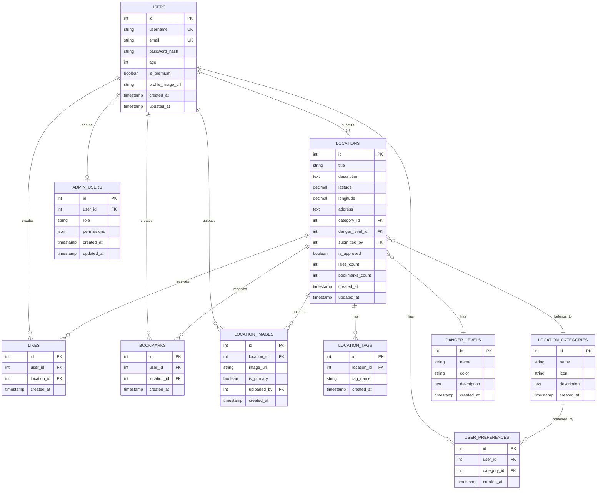

# Entity Relationship Diagram - Abandoned Buildings App

## Database Schema Overview

This document describes the Entity Relationship Diagram for the Abandoned Buildings Exploration mobile application.

## Entities and Relationships

### Core Entities

#### 1. Users
```
users
├── id (INT, PRIMARY KEY, AUTO_INCREMENT)
├── username (VARCHAR(50), UNIQUE, NOT NULL)
├── email (VARCHAR(100), UNIQUE, NOT NULL)
├── password_hash (VARCHAR(255), NOT NULL)
├── age (INT)
├── is_premium (BOOLEAN, DEFAULT FALSE)
├── profile_image_url (TEXT)
├── created_at (TIMESTAMP, DEFAULT CURRENT_TIMESTAMP)
└── updated_at (TIMESTAMP, DEFAULT CURRENT_TIMESTAMP ON UPDATE CURRENT_TIMESTAMP)
```

#### 2. Locations
```
locations
├── id (INT, PRIMARY KEY, AUTO_INCREMENT)
├── title (VARCHAR(200), NOT NULL)
├── description (TEXT, NOT NULL)
├── latitude (DECIMAL(10,8), NOT NULL)
├── longitude (DECIMAL(11,8), NOT NULL)
├── address (TEXT)
├── category_id (INT, FOREIGN KEY → location_categories.id)
├── danger_level_id (INT, FOREIGN KEY → danger_levels.id)
├── submitted_by (INT, FOREIGN KEY → users.id)
├── is_approved (BOOLEAN, DEFAULT FALSE)
├── likes_count (INT, DEFAULT 0)
├── bookmarks_count (INT, DEFAULT 0)
├── created_at (TIMESTAMP, DEFAULT CURRENT_TIMESTAMP)
└── updated_at (TIMESTAMP, DEFAULT CURRENT_TIMESTAMP ON UPDATE CURRENT_TIMESTAMP)
```

#### 3. Location Categories
```
location_categories
├── id (INT, PRIMARY KEY, AUTO_INCREMENT)
├── name (VARCHAR(100), NOT NULL)
├── icon (VARCHAR(50), NOT NULL)
├── description (TEXT)
└── created_at (TIMESTAMP, DEFAULT CURRENT_TIMESTAMP)
```

#### 4. Danger Levels
```
danger_levels
├── id (INT, PRIMARY KEY, AUTO_INCREMENT)
├── name (VARCHAR(50), NOT NULL)
├── color (VARCHAR(20), NOT NULL)
├── description (TEXT)
└── created_at (TIMESTAMP, DEFAULT CURRENT_TIMESTAMP)
```

### Interaction Entities

#### 5. Likes
```
likes
├── id (INT, PRIMARY KEY, AUTO_INCREMENT)
├── user_id (INT, FOREIGN KEY → users.id)
├── location_id (INT, FOREIGN KEY → locations.id)
├── created_at (TIMESTAMP, DEFAULT CURRENT_TIMESTAMP)
└── UNIQUE KEY (user_id, location_id)
```

#### 6. Bookmarks
```
bookmarks
├── id (INT, PRIMARY KEY, AUTO_INCREMENT)
├── user_id (INT, FOREIGN KEY → users.id)
├── location_id (INT, FOREIGN KEY → locations.id)
├── created_at (TIMESTAMP, DEFAULT CURRENT_TIMESTAMP)
└── UNIQUE KEY (user_id, location_id)
```

#### 7. Location Images
```
location_images
├── id (INT, PRIMARY KEY, AUTO_INCREMENT)
├── location_id (INT, FOREIGN KEY → locations.id)
├── image_url (TEXT, NOT NULL)
├── is_primary (BOOLEAN, DEFAULT FALSE)
├── uploaded_by (INT, FOREIGN KEY → users.id)
├── created_at (TIMESTAMP, DEFAULT CURRENT_TIMESTAMP)
└── INDEX (location_id)
```

#### 8. Location Tags
```
location_tags
├── id (INT, PRIMARY KEY, AUTO_INCREMENT)
├── location_id (INT, FOREIGN KEY → locations.id)
├── tag_name (VARCHAR(50), NOT NULL)
├── created_at (TIMESTAMP, DEFAULT CURRENT_TIMESTAMP)
└── INDEX (location_id)
```

### Admin and User Management

#### 9. Admin Users
```
admin_users
├── id (INT, PRIMARY KEY, AUTO_INCREMENT)
├── user_id (INT, FOREIGN KEY → users.id, UNIQUE)
├── role (ENUM('admin', 'moderator'), DEFAULT 'admin')
├── permissions (JSON)
├── created_at (TIMESTAMP, DEFAULT CURRENT_TIMESTAMP)
└── updated_at (TIMESTAMP, DEFAULT CURRENT_TIMESTAMP ON UPDATE CURRENT_TIMESTAMP)
```

#### 10. User Preferences
```
user_preferences
├── id (INT, PRIMARY KEY, AUTO_INCREMENT)
├── user_id (INT, FOREIGN KEY → users.id)
├── category_id (INT, FOREIGN KEY → location_categories.id)
├── created_at (TIMESTAMP, DEFAULT CURRENT_TIMESTAMP)
└── UNIQUE KEY (user_id, category_id)
```

## Relationships

### One-to-Many Relationships

1. **users → locations**
   - One user can submit many locations
   - `locations.submitted_by` → `users.id`

2. **location_categories → locations**
   - One category can have many locations
   - `locations.category_id` → `location_categories.id`

3. **danger_levels → locations**
   - One danger level can apply to many locations
   - `locations.danger_level_id` → `danger_levels.id`

4. **locations → location_images**
   - One location can have many images
   - `location_images.location_id` → `locations.id`

5. **locations → location_tags**
   - One location can have many tags
   - `location_tags.location_id` → `locations.id`

6. **users → location_images**
   - One user can upload many images
   - `location_images.uploaded_by` → `users.id`

### Many-to-Many Relationships

1. **users ↔ locations (likes)**
   - Many users can like many locations
   - Through `likes` table with `user_id` and `location_id`

2. **users ↔ locations (bookmarks)**
   - Many users can bookmark many locations
   - Through `bookmarks` table with `user_id` and `location_id`

3. **users ↔ location_categories (preferences)**
   - Many users can prefer many categories
   - Through `user_preferences` table with `user_id` and `category_id`

### One-to-One Relationships

1. **users → admin_users**
   - One user can have at most one admin record
   - `admin_users.user_id` → `users.id` (UNIQUE)

## Visual Representation



## Key Constraints and Indexes

### Primary Keys
- All tables have an `id` field as the primary key with AUTO_INCREMENT

### Unique Constraints
- `users.username` - Ensures unique usernames
- `users.email` - Ensures unique email addresses
- `admin_users.user_id` - One user can only have one admin record
- `likes(user_id, location_id)` - Prevents duplicate likes
- `bookmarks(user_id, location_id)` - Prevents duplicate bookmarks
- `user_preferences(user_id, category_id)` - Prevents duplicate preferences

### Indexes
- `location_images.location_id` - Fast lookup of images for a location
- `location_tags.location_id` - Fast lookup of tags for a location
- `likes.user_id` and `likes.location_id` - For efficient join operations
- `bookmarks.user_id` and `bookmarks.location_id` - For efficient join operations

## Data Integrity Rules

1. **Referential Integrity**: All foreign keys must reference existing records
2. **Location Approval**: Only approved locations appear in public feeds
3. **Admin Privileges**: Admin actions are restricted to users in `admin_users` table
4. **Image Association**: Images must be associated with existing locations
5. **User Actions**: Likes and bookmarks require authenticated users
6. **Category Consistency**: All locations must have valid categories and danger levels

## Statistics and Counters

The schema includes denormalized counters for performance:
- `locations.likes_count` - Updated when likes are added/removed
- `locations.bookmarks_count` - Updated when bookmarks are added/removed

These counters are maintained through database triggers or application logic to ensure consistency.
