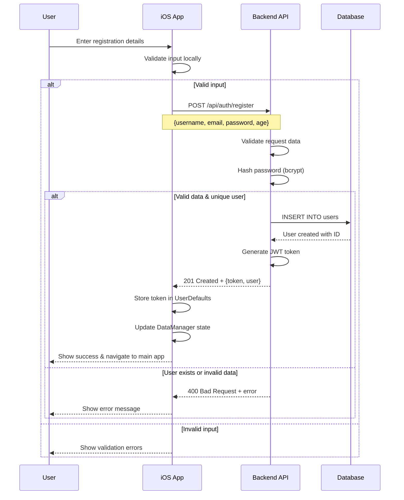
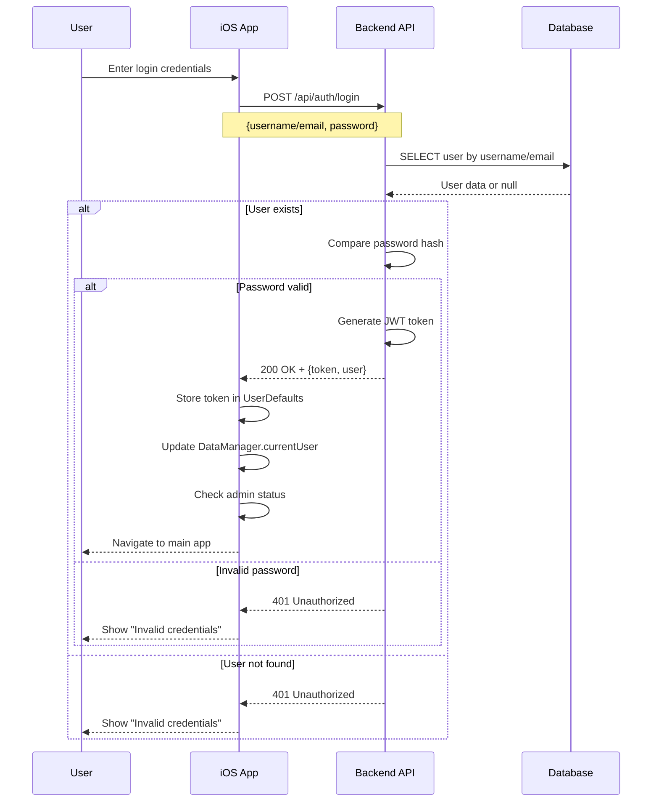
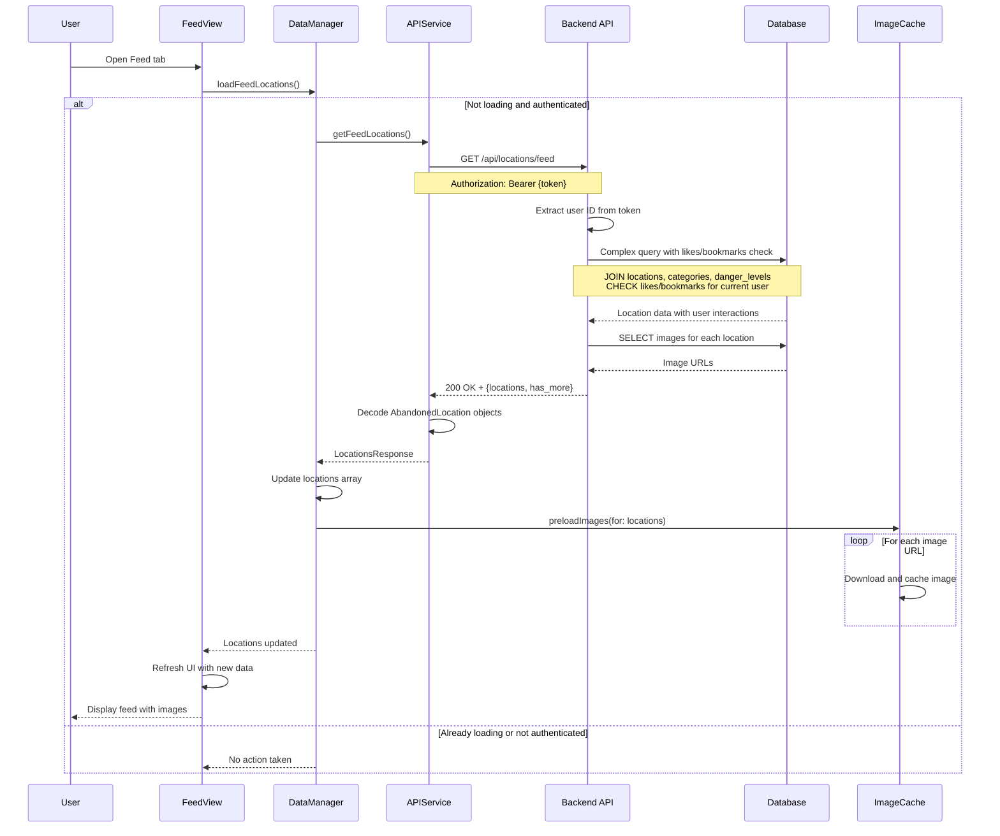
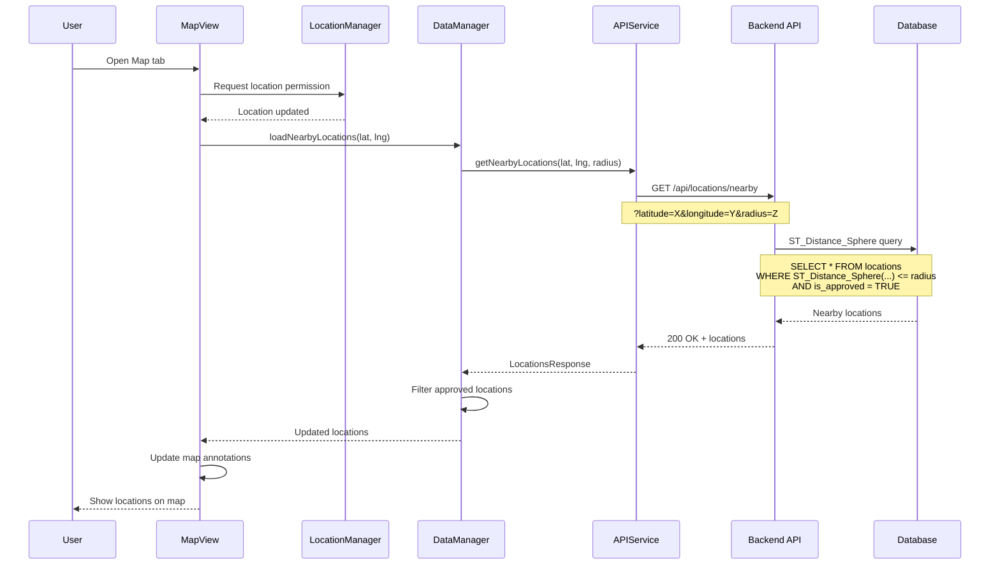
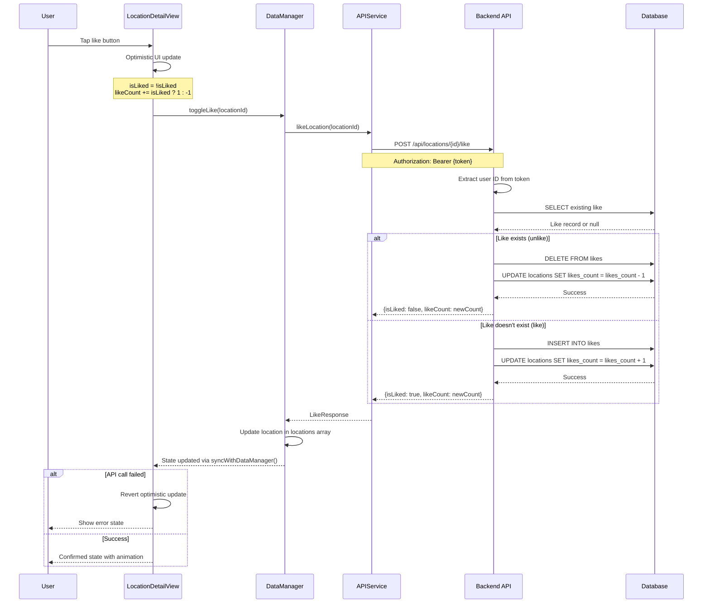
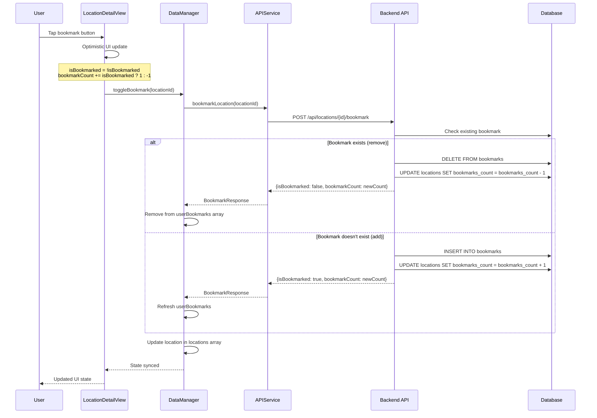
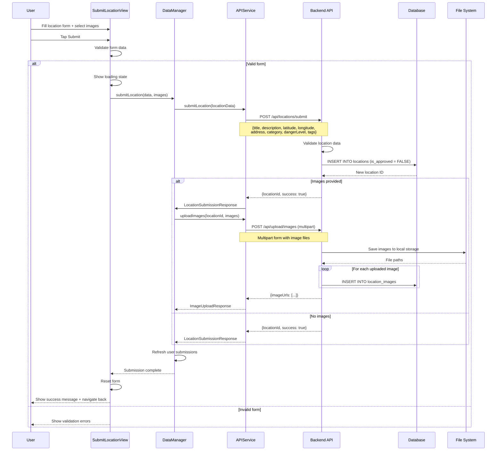
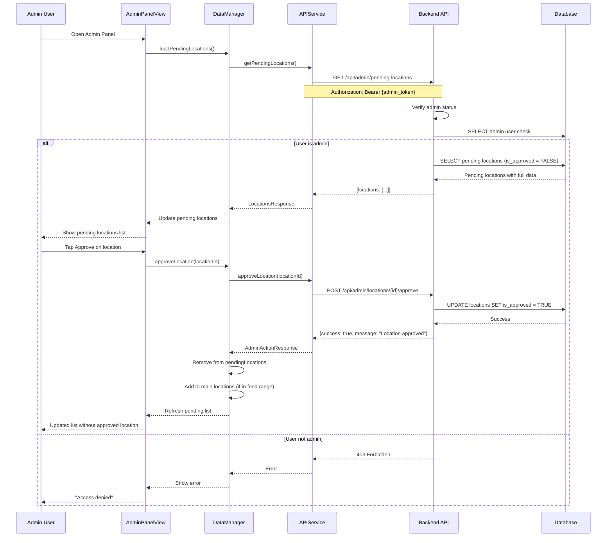
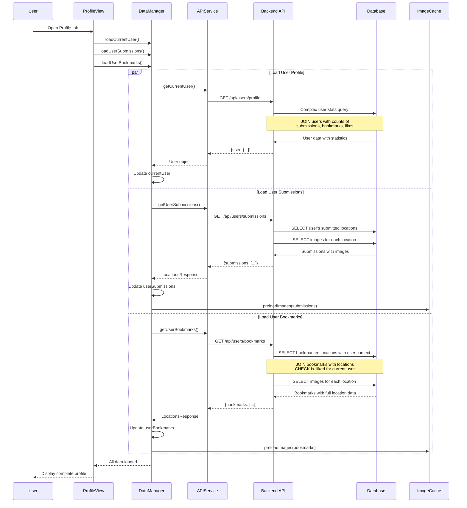
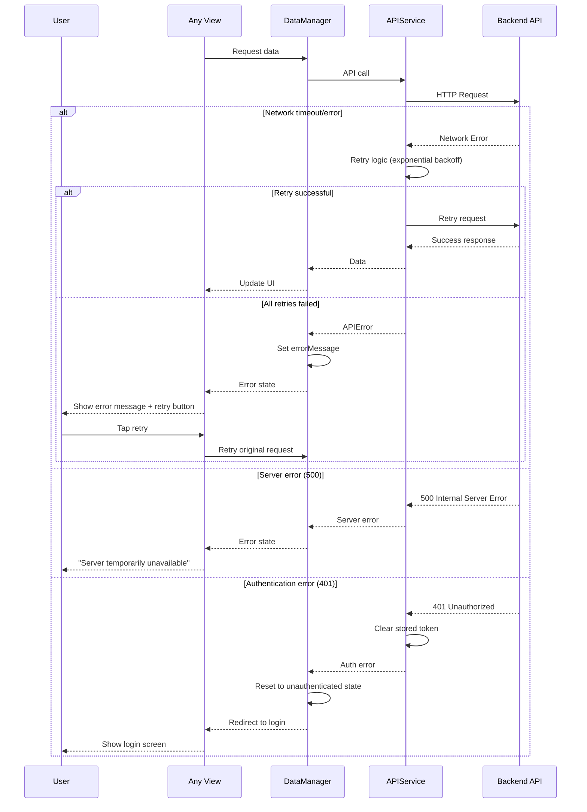

# Sequence Diagrams - Abandoned Buildings App

This document contains sequence diagrams for the key user flows in the Abandoned Buildings Exploration mobile application.

## 1. User Authentication Flow

### User Registration

### User Login

## 2. Location Discovery Flow

### Loading Feed Locations

### Loading Nearby Locations (Map)

## 3. Location Interaction Flow

### Like/Unlike Location

### Bookmark/Unbookmark Location

## 4. Location Submission Flow

### Submit New Location

## 5. Admin Operations Flow

### Admin Approve/Reject Location

## 6. Profile and Bookmarks Flow

### Load User Profile Data

## 7. Error Handling Patterns

### Network Error Recovery

## Key Design Patterns

### 1. Optimistic UI Updates
- User interactions (like/bookmark) update UI immediately
- API call happens in background
- Revert changes if API call fails

### 2. Data Synchronization
- DataManager maintains single source of truth
- Views observe DataManager published properties
- API responses update DataManager state

### 3. Image Caching
- Images are cached locally using ImageCache
- Preloading happens when data is fetched
- CachedAsyncImage provides instant display

### 4. Error Propagation
- API errors bubble up through DataManager
- Views observe errorMessage for user feedback
- Retry mechanisms for transient failures

### 5. Admin Security
- JWT tokens contain user role information
- Admin endpoints verify user permissions
- Client-side admin features hidden for non-admins
